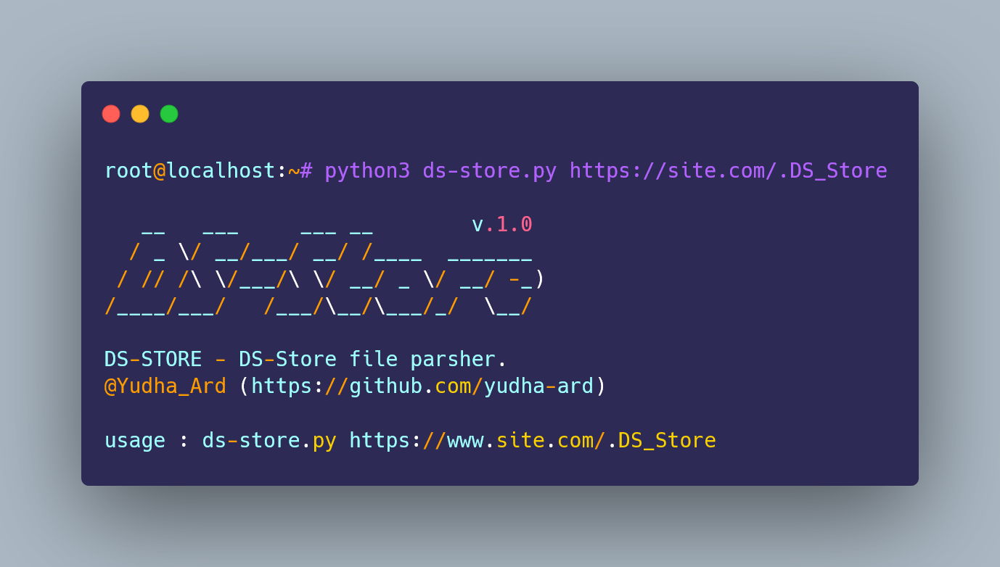

# DS-Store - .DS-Store file parsher


  
## Introduction

The DS-Store file parser is a tool designed to read and interpret .DS_Store files created by macOS in directories. These hidden files store metadata about folder attributes, such as icon positions and view settings. The parser extracts and displays this data in a human-readable format, making it useful for developers, system administrators, and digital forensics experts. By parsing the binary content of .DS_Store files, the tool enables easier analysis, management, and auditing of folder metadata, helping users retrieve relevant information or clean up unnecessary files.

### DS-Store Resources

 - **[PyPi - DS-Store](https://pypi.org/project/ds-store)**
 - **[Github - DS_Store_Exp](https://github.com/lijiejie/ds_store_exp)**

## Installation

``` bash
▶ git clone https://github.com/Yudha-ard/ds-store.git && cd ds-store

▶ pip install -r requirements.txt
```  

## Usage
```bash
▶ python3 ds-store https://example.com/.DS_Store
```
